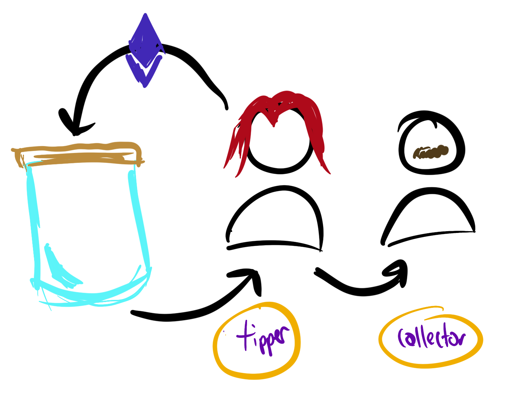

# Tipjar Collection

Different contracts for recieving tips. I want to help creators find new ways to fund themselves without relying on larger services.

## TipJarNft.sol

_Send tip -> get NFT_

Inspired by POAP and Gitcoin Kudos. 

This contract uses the metadata extension (ERC721Metadata) to disincentivize buying credibility. This isn't a big concern for smaller creators but may be a concern if you are a larger creator.

This works by having a specific URI, following the _ERC721 Metadata JSON Schema_, for the original tipper and one for the collector on the secondary market.

If you have no interest in disincentivizing credibility purchases, you can use the same URI for tipper and collector.

This is the expected process that would be followed:



1. Alice tips you with ETH
2. As a thank you, an NFT is minted and assigned to Alice. The associated metadata is located at the 'tipper URI'.
3. At some point later, Alice decides to sell the NFT to Bob
4. When Bob becomes an owner of the NFT, the `tokenURI` return value will now be located at the 'collector URI'.

Any time the owner of a token is not the minter of the token, the 'collector URI' is used as the metadata resource.

Here is the JSON Metadata schema from [EIP-721](https://eips.ethereum.org/EIPS/eip-721):

```json
{
    "title": "Asset Metadata",
    "type": "object",
    "properties": {
        "name": {
            "type": "string",
            "description": "Identifies the asset to which this NFT represents"
        },
        "description": {
            "type": "string",
            "description": "Describes the asset to which this NFT represents"
        },
        "image": {
            "type": "string",
            "description": "A URI pointing to a resource with mime type image/* representing the asset to which this NFT represents. Consider making any images at a width between 320 and 1080 pixels and aspect ratio between 1.91:1 and 4:5 inclusive."
        }
    }
}
```

### Caveats and words of warning

I have a number of tests but it isn't perfectly covered yet. I also have not done gas optimization. This is an alpha product, and not alpha in the fun way were you are making a bunch of money.
